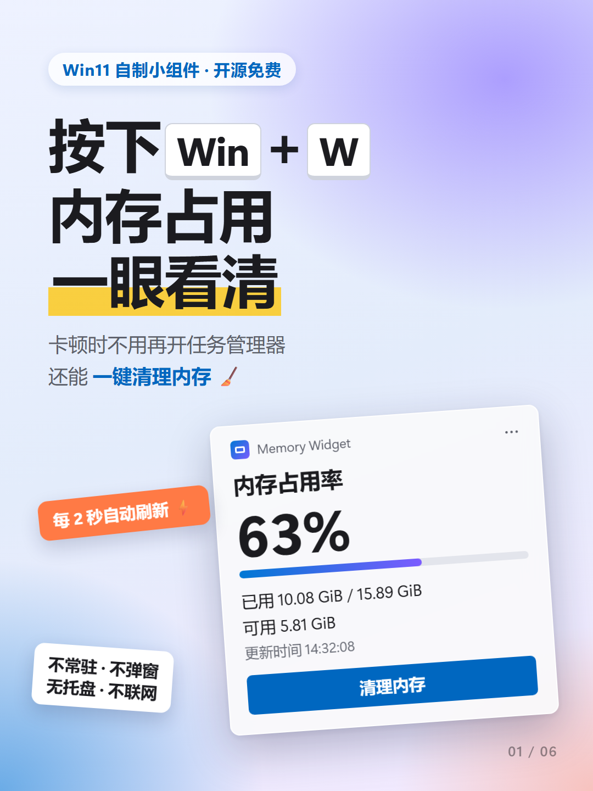

# 内存清理 · Windows 11 小组件

按 `Win + W` 打开小组件面板，就能看到电脑内存用了多少，卡的时候点一下「清理内存」。

## 能做什么

- 显示已用、总共、可用内存
- 一键清理内存：把各程序暂时用不到的内存还给系统，**不会关闭程序，也不会丢数据**
- 只在打开小组件面板时刷新，关掉面板就不再占用 CPU；没有窗口、没有托盘图标、不联网

## 安装

只需要做一次。推荐方式一：在你自己的电脑上生成安装包，不用信任别人的证书，最安全。

### 方式一：一键安装（推荐）

**1. 安装 .NET 8 SDK**

打开 [.NET 8 下载页](https://dotnet.microsoft.com/download/dotnet/8.0)，在左侧 **SDK 8.0.x** 下找到 Windows 一行，点击 **x64** 安装程序，下载后一路「下一步」装完。

> 不确定电脑是哪种架构就选 x64。已经装过的可以跳过这一步。

**2. 下载本项目**

在本页面顶部点击绿色的 **Code** 按钮 → **Download ZIP**，下载后右键 → **全部解压缩**。

**3. 双击 `一键安装.cmd`**

打开解压后的文件夹，双击 `一键安装.cmd`：

- 如果弹出「Windows 已保护你的电脑」，点 **更多信息** → **仍要运行**
- 弹出「是否允许此应用对你的设备进行更改」时点 **是**

然后等待黑色窗口跑完（第一次需要下载依赖，大约几分钟），看到绿色的「全部完成」即可，按任意键关闭窗口。

**4. 添加到小组件面板**

1. 按 `Win + W` 打开小组件面板
2. 点击右上角的 **+**（添加小组件）
3. 在列表里找到 **内存清理**，点击 **添加小组件**

完成！可以在小组件右上角的 `···` 菜单里切换大小。

### 方式二：下载安装包

如果 [Releases 页面](https://github.com/xxxifan/MemoryWidget/releases) 有发布版本，也可以直接下载安装：

1. 先安装两个微软官方运行库（选 x64）：[.NET 8 桌面运行时](https://dotnet.microsoft.com/download/dotnet/8.0)、[Windows App Runtime 1.8](https://learn.microsoft.com/windows/apps/windows-app-sdk/downloads)
2. 下载最新版本里的 `MemoryWidgetProvider.Dev.cer`（证书）和 `MemoryWidgetProvider.Dev.msix`（安装包）
3. 双击 `.cer` → **安装证书** → 存储位置选 **本地计算机** → **将所有的证书都放入下列存储** → **浏览** → 选择 **受信任的人** → **下一步** → **完成**
4. 双击 `.msix` → **安装**
5. 按上面方式一的第 4 步添加到小组件面板

## 常见问题

**一键安装提示没有找到 .NET 8？**

按方式一第 1 步安装 .NET 8 SDK（注意是 **8.0** 版本的 **SDK**），装好后重新双击 `一键安装.cmd`。

**双击 `.msix` 提示证书不受信任？**

方式二第 3 步的存储位置要选 **本地计算机**，证书要放进 **受信任的人**，重新导入一遍即可。

**面板里找不到「内存清理」？**

注销后重新登录 Windows，或者重启电脑后再试。

**怎么更新？**

- 方式一：下载新版本源码后重新双击 `一键安装.cmd`，会沿用你电脑上第一次生成的证书，自动替换旧版本。
- 方式二：下载新版本的 `.msix` 直接双击安装，不用重新导入证书。

**怎么卸载？**

打开 **设置 → 应用 → 已安装的应用**，找到 **内存清理**，点击 `···` → **卸载**。

## 系统要求

Windows 11 22H2 或更高版本。

## License

[MIT](LICENSE)
